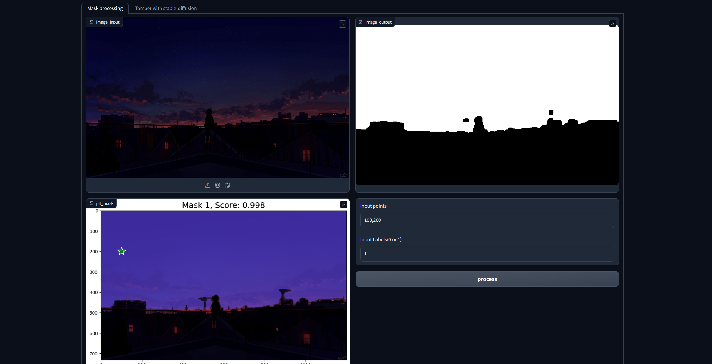
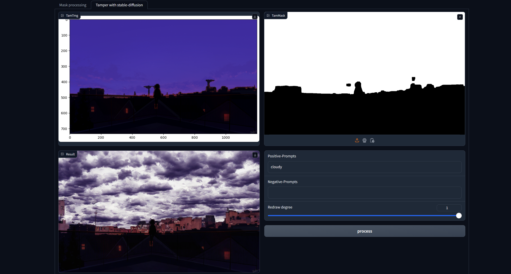

## Sam-stableDiffusion-Tampering-anything
### 简介
+ 使用segment-anything-model对图片指定区域进行分割并生成遮罩
+ 使用stableDiffusionInpainting Pipeline对遮罩区域重绘




### 使用
+ 安装segment-anything-model,diffusers,以及其依赖

```
git clone https://github.com/huggingface/diffusers.git
git clone https://github.com/facebookresearch/segment-anything.git
```
+ 安装依赖
```
pip install gradio opencv-python matplotlib
```
+ 运行"GradioUI.py"


### Tips
+ 需要至少8G显存来运行SegmentAnytingModel
+ 若运行out of memory，请降低图片分辨率


