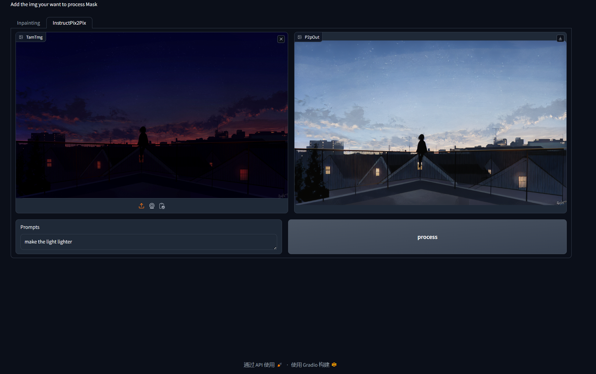

# Sam-stableDiffusion-Tampering-anything
## 简介
+ 使用segment-anything-model对图片指定区域进行分割并生成遮罩
+ 使用stableDiffusionInpainting Pipeline对遮罩区域重绘


 `1使用Inpainting管线_.生成遮罩`

 `1使用Inpainting管线_.重绘遮罩区域`

`2使用InstructPix2Pix管线_自然语言控制修改`


## 使用
### 准备
+ 安装segment-anything-model,diffusers,以及其依赖

```
git clone https://github.com/huggingface/diffusers.git
git clone https://github.com/facebookresearch/segment-anything.git
```
+ 安装依赖
```
pip install gradio opencv-python matplotlib
```
### 运行
 - 运行"GradioUI.py"
 - 在Input points 文本框输入选点坐标，例如:100,200 (x=100,y=200,两组坐标之间用空格分隔)
 - 在Input Labels(0 or 1) 输入选点Label，1表示该点为分割物体，0表示该点为背景
 - 点击process生成
 - 在prompt文本框内输入提示词
 - 使用滑杆调整重绘强度
 - 点击process生成


## Tips
+ 需要至少8G显存来运行SegmentAnytingModel
+ 若运行out of memory，请降低图片分辨率


